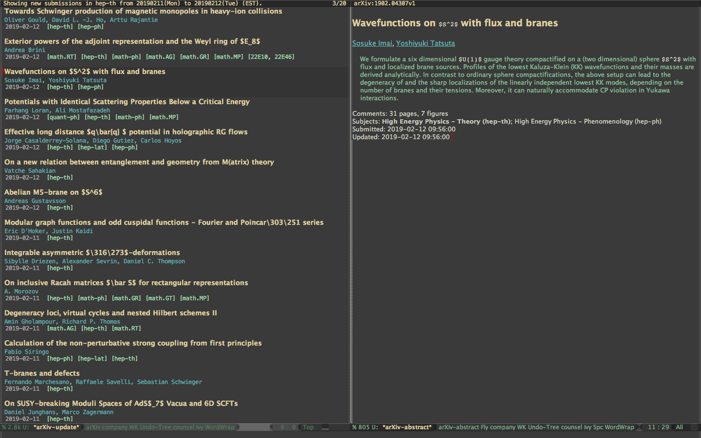

arXiv-mode
==========

arxiv-mode is an [Emacs](www.gnu.org/s/emacs/‎) major mode for viewing
updates on [arXiv.org](http://arxiv.org).



This is a fork of the original version of the arxiv-mode by Alex Chen (fizban007).
Several new functions and features are added to enhance the original mode.
I'm still working to improve the source code, so changes will happen frequently.

Common Usage
============

To start reading abstracts, run `M-x arxiv-read-new` and `M-x arxiv-read-recent`
to browse new and recent submissions in the given category.
Use `M-x arxiv-read-author` to search for specific author(s).

For complex searches, use `M-x arxiv-complex-search`.
This command allows user to dynamically refine and modify search conditions.
You can also use `r` to refine search condition in the abstract list obtained from a complex search.

In the article list, use `n` and `p` to navigate the article list.
Press `SPC` to toggle visibility of the abstract window. Press
`RET` to open the entry in a web browser. Press `d` to download the pdf.

arXiv mode now has the ability to export bibtex entry.
Simply press `b` or in the article list to export the bibtex entry of current paper to your specified .bib file.
Press `e` to download pdf and add a bibtex entry with a link to the actual pdf file.

All available commands are listed in a hydra help menu accessable by `?` whenever you are in the article list.

Installation
============

Just put the directory in your filesystem and at it to your
`load-path`. Put the following into your `.emacs` file

````lisp
(require 'arxiv-mode)
````

Customization
=============

`arxiv-mode` can be customized through emacs native customization
interface. Currently only a few variables can be modified but others
will be added as code develops. These can be found under the group
`arxiv`, or just run `arxiv-customize`.
